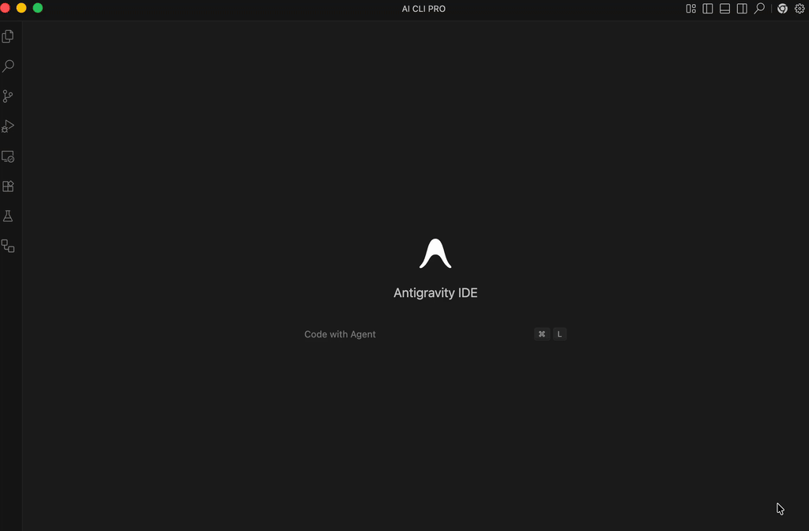

# 🚀 AI-CLI-PRO: The Terminal, Reimagined for the AI Era

[](https://marketplace.visualstudio.com/items?itemName=likhith-adithya.ai-cli-pro)
[](https://github.com/likhith-adithya/AI-CLI-PRO-Public/stargazers)
[](LICENSE)

### **Stop typing commands. Start commanding AI.** ⚡

AI-CLI-PRO is the ultimate bridge between your IDE and your terminal. It brings the world's most powerful AI models directly into your command line, enabling a workflow that is faster, smarter, and more autonomous than ever before.



[**👉 INSTALL NOW (VS Code Marketplace)**](https://marketplace.visualstudio.com/items?itemName=likhith-adithya.ai-cli-pro) • [**Open VSX**](https://open-vsx.org/extension/likhith-adithya/ai-cli-pro) • [**Sponsor the Innovation**](https://github.com/sponsors/likhith-adithya)

---

## 🔥 The AI-CLI-PRO Advantage

Why spend hours on things AI can do in seconds?

*   **⚡ Zero-Latency Insights:** Get immediate explanations and fixes for terminal errors.
*   **🤖 Agent Orchestration:** Deploy and manage AI agents with single-click precision.
*   **📂 Deep Context:** AI that understands your full project structure, not just one file.
*   **🛡️ Secure by Design:** Local-first architecture ensures your code stays private.

---

## ✨ Features Built for Power Users

### 🧠 **Intelligent Command Generation**
Never forget a complex `git` or `docker` command again. Just describe what you want, and AI-CLI-PRO writes it for you.

### 🛠️ **Autonomous Agent Hub**
Harness the power of autonomous agents like never before. Provision, update, and manage your agent fleet directly from your sidebar.

### 🌊 **Fluid Workflow Integration**
Built to feel like a native part of your IDE. Works perfectly in **Cursor**, **Windsurf**, **Trae**, and **Standard VS Code**.

---

## 📈 Growing with the Community

AI-CLI-PRO is trusted by developers worldwide, from solo hackers to enterprise engineers.

| Metric | Status |
| :--- | :--- |
| **🌍 Active Ecosystem** | [](https://marketplace.visualstudio.com/items?itemName=likhith-adithya.ai-cli-pro) |
| **🚀 Marketplace Rank** | [](https://marketplace.visualstudio.com/items?itemName=likhith-adithya.ai-cli-pro) |

### **Global Adoption Trend**


---

## ⚡ Quick Install

**1. Marketplace**
Search for `AI CLI PRO` in your extension panel.

**2. Command Line**
```bash
code --install-extension likhith-adithya.ai-cli-pro
```

---

## 🤝 Build the Future with Us

This repository is our community headquarters. We don't just build *for* you, we build *with* you.

*   [**💡 Have an Idea?**](../../issues/new?template=feature_request.md)
*   [**🔧 Found a Bug?**](../../issues/new?template=bug_report.md)
*   [**💬 Join the Discussions**](../../discussions)

---

## 💖 Support & Sponsorship

If AI-CLI-PRO helps you build better software, consider fueling our development.

[**💎 Become a Sponsor**](./SPONSORS.md) • [**⭐ Star the Repo**](https://github.com/likhith-adithya/AI-CLI-PRO-Public) • [**📢 Share on X**](https://twitter.com/intent/tweet?text=Check%20out%20AI-CLI-PRO%20-%20The%20ultimate%20AI-powered%20CLI!%20%23VSCode%20%23AI%20%23DevTools)

---

[Privacy Policy](docs/legal/PRIVACY.md) • [Terms of Service](docs/legal/TERMS.md) • [License](LICENSE)

**Join thousands of developers and start commanding the future today.** 🧠⚡
