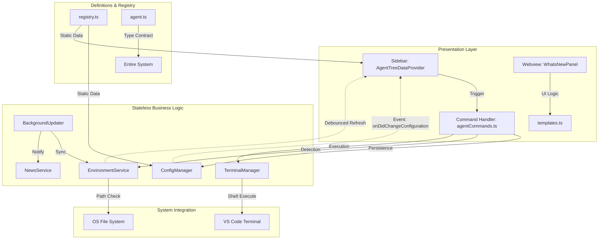

# 🏗️ AI CLI PRO: Architectural Blueprint & System Mapping

As a Senior AI Architect, this document outlines the internal mechanics of **AI CLI PRO**. It serves as the definitive guide to how components interact, how data flows, and how the "Ripple Effect" governs system stability.

---

## 🗺️ High-Level System Flow (Mermaid Visualization)

---

## 📄 File-by-File Task Allocation

### 1. The Core (Data & Identity)
*   **`src/models/agent.ts`**: Defines the `AgentConfig` interface. Every agent in the system must strictly adhere to this contract (id, command, installCommand, etc.).
*   **`src/models/registry.ts`**: The "Source of Truth." It contains the hardcoded configurations for built-in tools like Gemini, Claude, and AWS.

### 2. The Engine (Services)
*   **`src/services/environmentService.ts`**: The **System Sentry**. It checks if a CLI (like `aws` or `gemini`) is actually installed. It uses a persistent cache to ensure the VS Code UI never "flickers" while waiting for shell results.
*   **`src/services/terminalManager.ts`**: The **Executioner**. It handles the complexity of cross-platform shell commands. It knows that Windows needs `; if ($?)` while macOS needs `&&`.
*   **`src/services/configManager.ts`**: The **Librarian**. It manages `package.json` settings and global state. It merges the static `registry.ts` with user-defined custom CLIs.
*   **`src/services/backgroundUpdater.ts`**: The **Watchman**. Runs in the background to poll for installation status changes and extension updates.

### 3. The Face (UI & Providers)
*   **`src/providers/agentTreeDataProvider.ts`**: The **Painter**. It transforms raw JSON data from the services into the clickable icons and text you see in the sidebar.
*   **`src/ui/agentFlows.ts`**: The **Interrogator**. Manages the multi-step QuickPick and InputBox flows for adding new agents.
*   **`src/ui/templates.ts`**: The **Architect**. Contains the HTML/CSS blueprints for the "What's New" webview.

---

## 🔗 Component Linkage & Ripple Effect

Understanding how one file affects another is critical for avoiding regressions.

| If you modify... | The Ripple Effect impacts... | Why? |
| :--- | :--- | :--- |
| **`registry.ts`** | `ConfigManager` & `Sidebar` | New agents will immediately appear in the UI and become available for installation. |
| **`agent.ts`** | **ENTIRE SYSTEM** | This is the base type. Changing a property name here requires updates in the Registry, ConfigManager, and UI. |
| **`environmentService.ts`** | `AgentItem` Icons | This service determines if an agent shows a "Green Check" (Verified) or a "Cloud Download" (Missing) icon. |
| **`terminalManager.ts`** | `agentCommands.ts` | Any logic change in how commands are "chained" affects every Install, Launch, and Update action. |
| **`configManager.ts`** | `package.json` Settings | Updates here change what the user sees in their VS Code Settings UI. |

---

## ⚡ System Lifecycle Logic

1.  **Activation**: `extension.ts` initializes all services.
2.  **Discovery**: `EnvironmentService` loads the cache and starts background verification of all registered CLIs.
3.  **Rendering**: `AgentTreeDataProvider` queries `ConfigManager` and `EnvironmentService` to draw the sidebar.
4.  **Interaction**: User clicks "Install" -> `agentCommands.ts` calls `TerminalManager.installAgent()` -> `TerminalManager` resolves the OS-specific script and sends it to a VS Code Terminal.
5.  **Feedback**: `EnvironmentService` detects the new installation, triggers a "Debounced Refresh," and the sidebar icon turns green.

---

## 🛡️ Architectural Principles
*   **Stateless Services**: Services do not hold temporary state; they rely on `GlobalState` or the `Registry`.
*   **OS-Agnostic Execution**: No command is ever run without checking `os.platform()`.
*   **Flicker-Free UI**: Always return a cached installation status immediately, then update it asynchronously.
